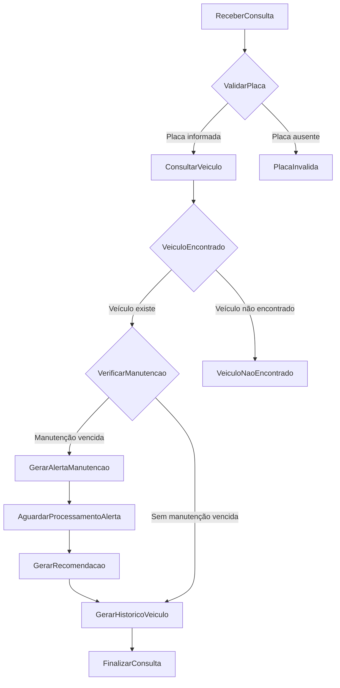
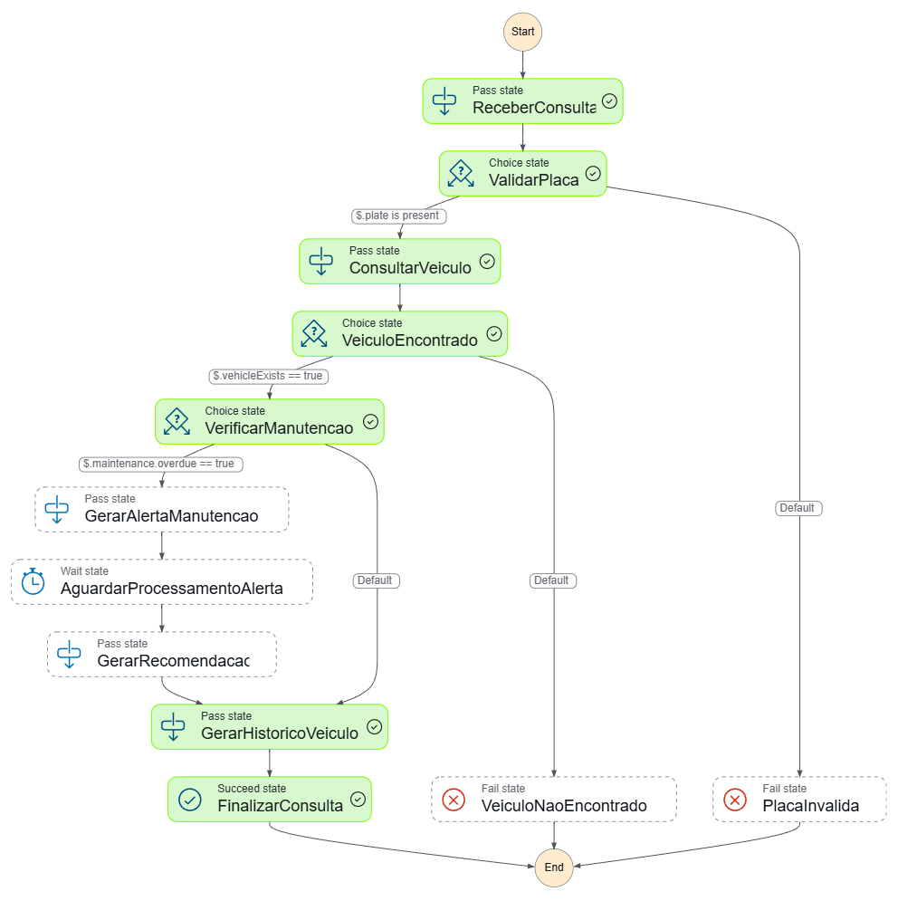
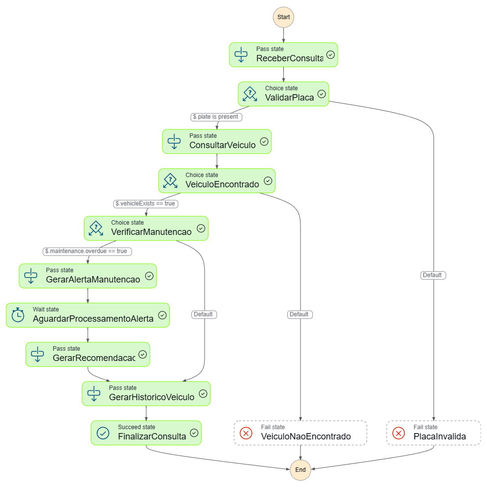
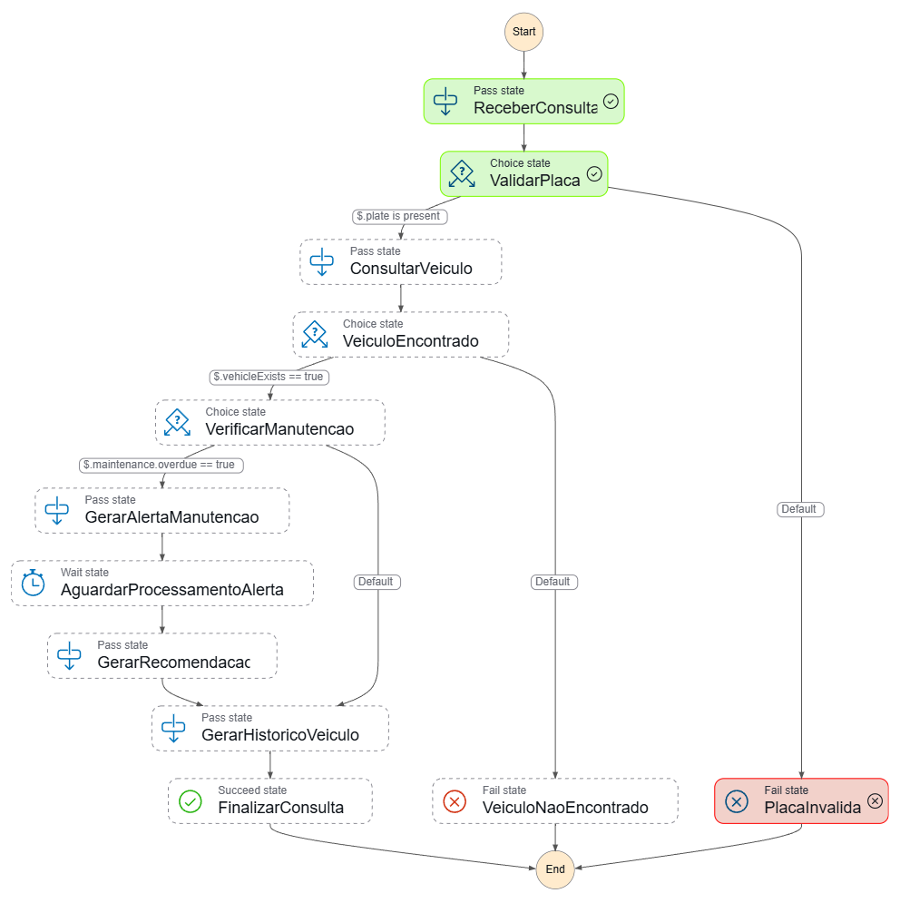
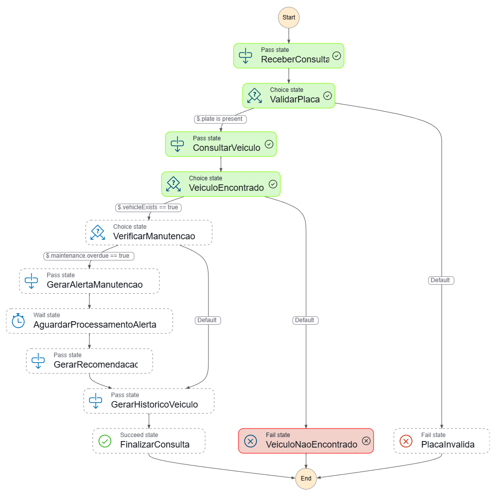

# AWS Step Functions - Vehicle History Workflow

Projeto simples desenvolvido para o desafio da DIO sobre **AWS Step Functions**.

A proposta deste projeto é simular um fluxo de consulta de histórico veicular usando uma máquina de estados serverless na AWS. O workflow recebe dados de um veículo, valida se a placa foi informada, verifica se o veículo existe, analisa se há manutenção vencida e finaliza a execução com sucesso ou com erro controlado.

Este projeto foi inspirado no conceito de um sistema chamado **Vehicle History**, onde o usuário pode consultar dados de um veículo e visualizar informações importantes sobre manutenção.

---

## Objetivo

O objetivo deste projeto é demonstrar, de forma simples e prática, o uso do **AWS Step Functions** para orquestrar um fluxo de negócio com validações, decisões condicionais, espera de processamento e tratamento de falhas.

O fluxo foi criado sem uso de Lambda, banco de dados ou integrações externas, para manter o foco nos conceitos principais do Step Functions.

---

## Tecnologias e serviços utilizados

* AWS Step Functions
* Amazon States Language
* JSON
* GitHub
* Markdown

---

## Conceitos aplicados

Este projeto utiliza os seguintes tipos de estados do AWS Step Functions:

* `Pass`: usado para simular etapas de processamento.
* `Choice`: usado para criar decisões condicionais no fluxo.
* `Wait`: usado para simular tempo de processamento.
* `Succeed`: usado para finalizar uma execução com sucesso.
* `Fail`: usado para finalizar uma execução com erro controlado.

---

## Estrutura do projeto

```text
aws-stepfunctions-vehicle-history/
├── README.md
├── .gitignore
├── statemachine/
│   └── vehicle-history-workflow.asl.json
├── inputs/
│   ├── success-with-maintenance-alert.json
│   ├── success-without-maintenance-alert.json
│   ├── invalid-plate.json
│   └── vehicle-not-found.json
└── docs/
    └── images/
        ├── 01-workflow-visual.png
        ├── 02-success-maintenance-alert.png
        ├── 03-success-without-alert.png
        ├── 04-error-invalid-plate.png
        └── 05-error-vehicle-not-found.png
```

---

## Descrição do fluxo

A máquina de estados simula uma consulta de histórico veicular com as seguintes etapas:

1. Receber a solicitação de consulta.
2. Validar se a placa do veículo foi informada.
3. Simular a consulta dos dados do veículo.
4. Verificar se o veículo foi encontrado.
5. Verificar se existe manutenção vencida.
6. Gerar alerta de manutenção, quando necessário.
7. Aguardar o processamento do alerta.
8. Gerar uma recomendação preventiva.
9. Gerar o histórico do veículo.
10. Finalizar a execução com sucesso ou erro controlado.

---

## Fluxo da máquina de estados



---

## Visual do workflow na AWS


---

## Como executar o projeto na AWS

### 1. Acessar o serviço

Acesse o console da AWS e procure por:

```text
Step Functions
```

### 2. Criar uma nova State Machine

Clique em:

```text
Create state machine
```

ou:

```text
Criar máquina de estado
```

### 3. Escolher modo de criação

Escolha a opção de criação usando código ou edite o template inicial no modo `Code`.

### 4. Usar o arquivo da máquina de estados

Copie o conteúdo do arquivo:

```text
statemachine/vehicle-history-workflow.asl.json
```

e cole no editor da AWS Step Functions.

### 5. Definir o nome

Sugestão de nome para a máquina de estados:

```text
vehicle-history-workflow
```

### 6. Selecionar o tipo

Escolha o tipo:

```text
Standard
```

### 7. Criar uma execução

Após criar a máquina de estados, clique em:

```text
Start execution
```

Depois, utilize um dos arquivos da pasta `inputs/` como entrada da execução.

---

## Cenários de teste

Foram criados quatro cenários de teste para validar o comportamento da máquina de estados.

---

### 1. Consulta com manutenção vencida

Arquivo:

```text
inputs/success-with-maintenance-alert.json
```

Entrada utilizada:

```json
{
  "plate": "XYZ9A88",
  "vehicleExists": true,
  "vehicle": {
    "brand": "Toyota",
    "model": "Corolla",
    "year": 2018,
    "currentMileage": 85000
  },
  "maintenance": {
    "lastMileage": 70000,
    "nextMileage": 80000,
    "overdue": true
  }
}
```

Neste cenário, a placa é informada, o veículo existe e existe uma manutenção vencida.

O fluxo gera um alerta de manutenção, aguarda o processamento e cria uma recomendação preventiva.

Resultado esperado:

```text
Succeeded
```

Evidência da execução:



---

### 2. Consulta sem manutenção vencida

Arquivo:

```text
inputs/success-without-maintenance-alert.json
```

Entrada utilizada:

```json
{
  "plate": "ABC1D23",
  "vehicleExists": true,
  "vehicle": {
    "brand": "Honda",
    "model": "Civic",
    "year": 2020,
    "currentMileage": 42000
  },
  "maintenance": {
    "lastMileage": 40000,
    "nextMileage": 50000,
    "overdue": false
  }
}
```

Neste cenário, a placa é informada, o veículo existe, mas não há manutenção vencida.

O fluxo pula as etapas de alerta e recomendação, seguindo diretamente para a geração do histórico.

Resultado esperado:

```text
Succeeded
```

Evidência da execução:



---

### 3. Consulta sem placa

Arquivo:

```text
inputs/invalid-plate.json
```

Entrada utilizada:

```json
{
  "vehicleExists": true,
  "maintenance": {
    "overdue": false
  }
}
```

Neste cenário, a entrada não possui o campo `plate`.

A máquina de estados identifica a ausência da placa e finaliza a execução no estado de falha `PlacaInvalida`.

Resultado esperado:

```text
Failed
```

Evidência da execução:



---

### 4. Veículo não encontrado

Arquivo:

```text
inputs/vehicle-not-found.json
```

Entrada utilizada:

```json
{
  "plate": "AAA1B22",
  "vehicleExists": false,
  "maintenance": {
    "overdue": false
  }
}
```

Neste cenário, a placa é informada, mas o campo `vehicleExists` está como `false`.

A máquina de estados direciona a execução para o estado de falha `VeiculoNaoEncontrado`.

Resultado esperado:

```text
Failed
```

Evidência da execução:



---

## Resultado esperado do projeto

Ao final da execução, o projeto demonstra que o AWS Step Functions pode ser usado para controlar um fluxo de negócio com múltiplos caminhos possíveis.

O workflow cobre:

* Caminho de sucesso com manutenção vencida.
* Caminho de sucesso sem manutenção vencida.
* Erro por placa não informada.
* Erro por veículo não encontrado.

---

## Possíveis melhorias futuras

Este projeto foi desenvolvido de forma simples para fins educacionais. Em uma versão mais completa, seria possível adicionar:

* AWS Lambda para processar regras reais de negócio.
* Amazon DynamoDB para armazenar dados dos veículos.
* Amazon API Gateway para expor uma API HTTP.
* Amazon SNS ou Amazon SES para envio de alertas de manutenção.
* Amazon Bedrock para gerar recomendações inteligentes sobre manutenção.
* Integração com um aplicativo mobile.
* Autenticação e autorização para usuários.

---

## Aprendizados

Durante o desenvolvimento deste projeto, foram praticados conceitos importantes de orquestração serverless, como:

* Criação de uma máquina de estados.
* Uso de Amazon States Language.
* Controle de fluxo com estados condicionais.
* Simulação de etapas de processamento.
* Tratamento de sucesso e falha.
* Organização de exemplos de entrada para testes.
* Documentação de um projeto técnico no GitHub.

---

## Conclusão

Este projeto demonstra uma aplicação simples do AWS Step Functions em um cenário inspirado em um sistema real de histórico veicular.

Mesmo sem integrações externas, o workflow mostra como é possível modelar um processo de negócio usando estados, decisões, esperas e tratamentos de erro dentro de uma arquitetura serverless.
